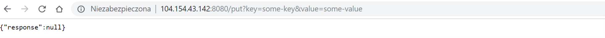
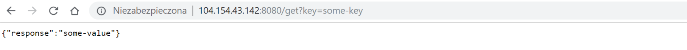

# Hazelcast embedded on Kubernetes

This is a sample Spring Boot application with multiple embedded Hazelcast, which presents forming a Hazelcast cluster on Kubernetes.

This sample uses Kubernetes API for Hazelcast member discovery.

## 1. Build application and Docker image

To build your application, use Maven:
```bash
mvn clean package
```

Then, you can build Docker image with the use of `Dockerfile`.
```bash
docker build -t leszko/hazelcast-kubernetes-embedded-sample .
```

Please change `leszko` to your Docker Hub login.

Push the image into the registry.

```bash
docker push leszko/hazelcast-kubernetes-embedded-sample
```

## 2. Grant access to Kubernetes API

In order for the POD to use Kubernetes API, you need to create the given Role Binding.

```bash
kubectl apply -f rbac.yaml
```

## 3. Deploy application

Update `deployment.yaml` with the image you pushed to Docker Hub. Then, to deploy an application, run the following command:

```bash
kubectl apply -f deployment.yaml
```

## 4. Verify that Application works correctly

You can check that the Deployment and Service were created.

```
$ kubectl get all
NAME                                        READY     STATUS    RESTARTS   AGE
pod/hazelcast-embedded-1-7c477b6949-djxlh   1/1       Running   0          13s
pod/hazelcast-embedded-1-7c477b6949-ptdd4   1/1       Running   0          13s
pod/hazelcast-embedded-2-75b6f4f5bf-jsj2p   1/1       Running   0          12s
pod/hazelcast-embedded-2-75b6f4f5bf-sqxhp   1/1       Running   0          12s

NAME                           TYPE           CLUSTER-IP      EXTERNAL-IP   PORT(S)          AGE
service/app-1                  LoadBalancer   10.19.255.88    <pending>     8080:30067/TCP   12s
service/app-2                  LoadBalancer   10.19.242.127   <pending>     8080:30927/TCP   10s
service/hazelcast-separate-1   ClusterIP      10.19.255.62    <none>        5702/TCP         11s
service/hazelcast-separate-2   ClusterIP      10.19.254.118   <none>        5702/TCP         9s
service/hazelcast-shared-1     ClusterIP      10.19.241.65    <none>        5701/TCP         11s
service/hazelcast-shared-2     ClusterIP      10.19.254.19    <none>        5701/TCP         10s
service/kubernetes             ClusterIP      10.19.240.1     <none>        443/TCP          3h

NAME                                         DESIRED   CURRENT   UP-TO-DATE   AVAILABLE   AGE
deployment.extensions/hazelcast-embedded-1   2         2         2            2           13s
deployment.extensions/hazelcast-embedded-2   2         2         2            2           12s

NAME                                                    DESIRED   CURRENT   READY     AGE
replicaset.extensions/hazelcast-embedded-1-7c477b6949   2         2         2         13s
replicaset.extensions/hazelcast-embedded-2-75b6f4f5bf   2         2         2         12s

NAME                                   DESIRED   CURRENT   UP-TO-DATE   AVAILABLE   AGE
deployment.apps/hazelcast-embedded-1   2         2         2            2           13s
deployment.apps/hazelcast-embedded-2   2         2         2            2           12s

NAME                                              DESIRED   CURRENT   READY     AGE
replicaset.apps/hazelcast-embedded-1-7c477b6949   2         2         2         13s
replicaset.apps/hazelcast-embedded-2-75b6f4f5bf   2         2         2         12s
```

In the logs for PODs, you should see that the Hazelcast members formed a cluster.

```
$ kubectl logs pod/hazelcast-embedded-1-7c477b6949-djxlh
 ...
Members {size:4, ver:2} [
        Member [10.16.2.27]:5701 - 9de0987a-d799-4b58-8605-0b2d772011b1 this
        Member [10.16.2.29]:5701 - 77e60cd3-e6d7-42c9-b76a-45590fc39460
        Member [10.16.2.30]:5701 - bd1dea35-d80a-49c0-b375-708ad12ffc86
        Member [10.16.2.28]:5701 - 5c05331e-d75b-4b77-8571-918d2a764746
]

...

Members {size:2, ver:2} [
        Member [10.16.2.27]:5702 - 977d9f3f-2dd9-4c47-8b6a-ad53e102eec1 this
        Member [10.16.2.28]:5702 - d9127ed4-419b-41c7-8f41-9029f7d2e084
]
 ...
```

Then, you can access the application, by its `EXTERNAL-IP`.



